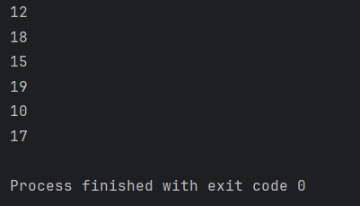
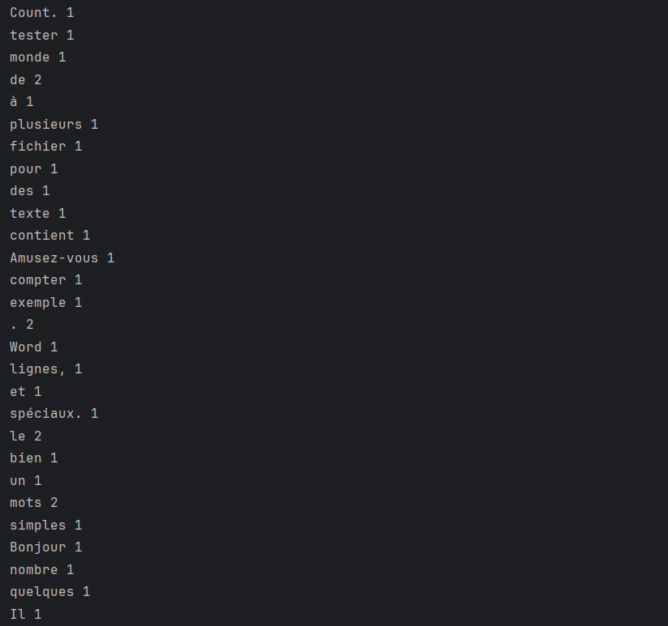
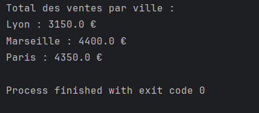
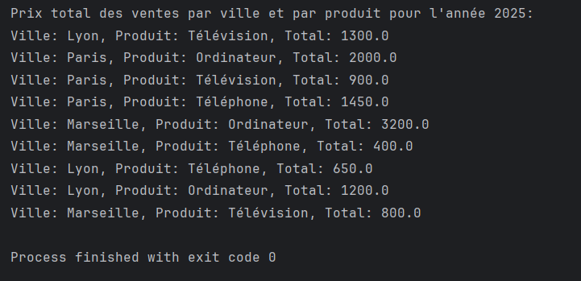

<!DOCTYPE html>
<html lang="fr">
<head>
# Projet Spark - TP avec RDD et Transformation

## Description
Ce projet utilise Apache Spark pour effectuer différentes opérations sur des données distribuées à l'aide de RDD (Resilient Distributed Datasets) et de transformations basiques. L'application est composée de plusieurs classes Java exécutant différentes tâches liées à l'analyse de données, telles que le comptage de mots et le calcul de ventes totales par ville.

## Objectifs
- Effectuer des transformations et actions de base avec RDD dans Apache Spark.
- Appliquer des opérations telles que le comptage des mots et le calcul de totaux sur des ensembles de données distribuées.
- Développer des applications Java utilisant Spark pour traiter des données en mode local.

## Structure du Projet

    ├── pom.xml
    ├── src/
    │   ├── sid/org/
    │   │   ├── App1.java
    │   │   ├── App2.java
    │   │   ├── App3.java
    │   │   └── App4.java
    └── README.md

## Technologies Utilisées
- **Apache Spark** : pour le traitement des données distribuées.
- **Java 8** : pour la programmation.
- **Maven** : pour la gestion des dépendances et l'exécution du projet.

## Installation
Pour commencer à utiliser ce projet, veuillez suivre les étapes ci-dessous :
1. **Cloner le dépôt :**
    ```bash
    git clone https://github.com/votre-utilisateur/nom-du-repository.git
    ```
2. **Configurer Maven :**
   Assurez-vous que Maven est installé sur votre machine. Si ce n'est pas le cas, vous pouvez l'installer en suivant les instructions [ici](https://maven.apache.org/install.html).
3. **Installer les dépendances :**
    ```bash
    mvn install
    ```
4. **Exécuter l'application :**
   Vous pouvez exécuter les différentes applications en utilisant Maven :
    ```bash
    mvn exec:java -Dexec.mainClass="sid.org.App1"
    mvn exec:java -Dexec.mainClass="sid.org.App2"
    mvn exec:java -Dexec.mainClass="sid.org.App3"
    mvn exec:java -Dexec.mainClass="sid.org.App4"
    ```

## Fonctionnalités
- **App1** : Applique des transformations sur un RDD d'entiers (ajouter 1 et filtrer les éléments supérieurs ou égaux à 10).
- **App2** : Effectue un comptage des mots dans un fichier texte (Word Count).
- **App3** : Calcule le total des ventes par ville à partir d'un fichier de ventes.
- **App4** : Calcule le total des ventes par ville et par produit pour une année spécifique (ex. 2025).

## Contributions
Les contributions au projet sont les bienvenues ! Pour contribuer :
1. Fork ce dépôt.
2. Crée une branche (`git checkout -b feature/xyz`).
3. Commit tes changements (`git commit -am 'Ajout d'une nouvelle fonctionnalité'`).
4. Push sur la branche (`git push origin feature/xyz`).
5. Ouvre une pull request.

## Licence
Ce projet est sous licence [MIT](https://opensource.org/licenses/MIT).

## Captures d'écran

### App1 - Transformation sur RDD


### App2 - Comptage des mots


### App3 - Calcul des ventes par ville


### App4 - Ventes par ville et produit

  
